# Querier HTB Vulnerability Report

<aside>
✒️ Author: Anh Duy Nguyen aka Turi Ip Ip

</aside>

## 1. Executive summary:

This section covers a collection of vulnerabilities discovered in the Queier HTB challenge. The vulnerabilities are categorised from low to critical, according to their potential
impact on Querier HTB. Each exploit has been described, and potential fixes have been
proposed. 

Overall, the exploitation of these vulnerabilities could lead to full system compromise, demonstrating the need for immediate remediation to enhance the security of the Querier challenge.

## 2. Vulnerability Classification & Risk Matrix

A risk assessment matrix, often known as a risk matrix, is a guide used to identify any or all the
possible business hazards. This is constructed using 2 factors: the likelihood of an event
occuring and the potential impact on the business. It allows the business to see the likelihood vs
severity of a possible danger. Risks are then categorised based on their likelihood and severity.
These are then used in the risk management process to assist firms in prioritising distinct risks
and building an effective mitigation plan.

The likelihood would mean the number of times a potential attack would be carried out to exploit
a vulnerability in the system, and impact would mean the loss of income and reputation to the
business. Under each of these factors, we have defined 5 categories.
**Likelihood:**

- Rare: 0-10%
- Unlikely: 10-30%
- Moderate: 30-80%
- Likely: 80-90%
- Almost Certain 90% - 100%

**Impact:**

- Insignificant: Negligible consequences on income and reputation. It might not
even be noticeable.
- Minor: Minor financial losses and reputational damage. It would require some
effort to rectify but wouldn't cause significant harm.
- Moderate: Moderate financial losses and reputation damage. It would require
immediate attention and resources to address.
- Major:  Major financial losses and severe damage to the reputation of the
business. It would significantly disrupt operations and require extensive
resources to mitigate.
- Catastrophic : Catastrophic consequences on income and reputation. It could
potentially lead to the downfall of the business or severe long-term
consequences.

On the basis of [Bugcrowd’s Vulnerability Rating Taxonomy](https://bugcrowd.com/vulnerability-rating-taxonomy), we have defined vulnerability classification as below:

1. P1 - Critical
Vulnerabilities that cause a privilege escalation on the platform from unprivileged to
admin, allows remote code execution, financial theft, loss of integrity of the database,
etc. Examples: vulnerabilities that result in Remote Code Execution such as Vertical
Authentication bypass, SSRF, SQL Injection, User authentication bypass.
2. P2 - High
Vulnerabilities that affect the security of the platform including the processes it supports.
Examples: Lateral authentication bypass.
3. P3 - Medium
Vulnerabilities that affect multiple users, and require little or no user interaction to trigger.
Examples: Direct object reference, URL Redirect, InDirect object reference.
4. P4 - Low
Issues that affect singular users and require interaction or significant prerequisites (MitM)
to trigger. Examples: Common flaws, Debug information, Mixed Content.

| Impact | Almost Certain | Likely | Moderate | Unlikely | Rare |
| --- | --- | --- | --- | --- | --- |
| Insignificant | P4 | P4 | P4 | P5 | P5 |
| Minor | P3 | P4 | P4 | P4 | P5 |
| Moderate | P2 | P3 | P3 | P3 | P4 |
| Major | P1 | P2 | P2 | P3 | P4 |
| Catastrophic | P1 | P1 | P2 | P3 | P3 |

## 3. Table of Contents

1. [Executive Summary](https://www.notion.so/Querier-HTB-Vulnerability-Report-6288ee3a1766420eaa896866f1022078?pvs=21)
2. [Vulnerability Classification & Risk Matrix](https://www.notion.so/Querier-HTB-Vulnerability-Report-6288ee3a1766420eaa896866f1022078?pvs=21)
3. Table of Contents (You are here)
4. [Technical Details](https://www.notion.so/Querier-HTB-Vulnerability-Report-6288ee3a1766420eaa896866f1022078?pvs=21)
    1. Reconnaissance
        1. NMAP scan
        2. SMB enumeration
        3. Discovery of Report.xlms
        4. MSSQL
    2. Exploitation
        1. mssql-svc enumeration
        2. Crack netntlmv2 using hashcat
        3. Connect to mssql-srv and read user flag
    3. Privilege Escalation To Admin (**mssql-svc –> Administrator)**
        1. Enumeration
        2. Administrator Shell
5. Impact Rating
6. Mitigation & Recommendations
7. Conclusion

## 4. Technical Details

### **a. Reconnaissance**

**i. NMAP scan**

To begin the challenge, I conducted an initial scan using nmap `nmap -A -p- -T4 10.10.10.125`

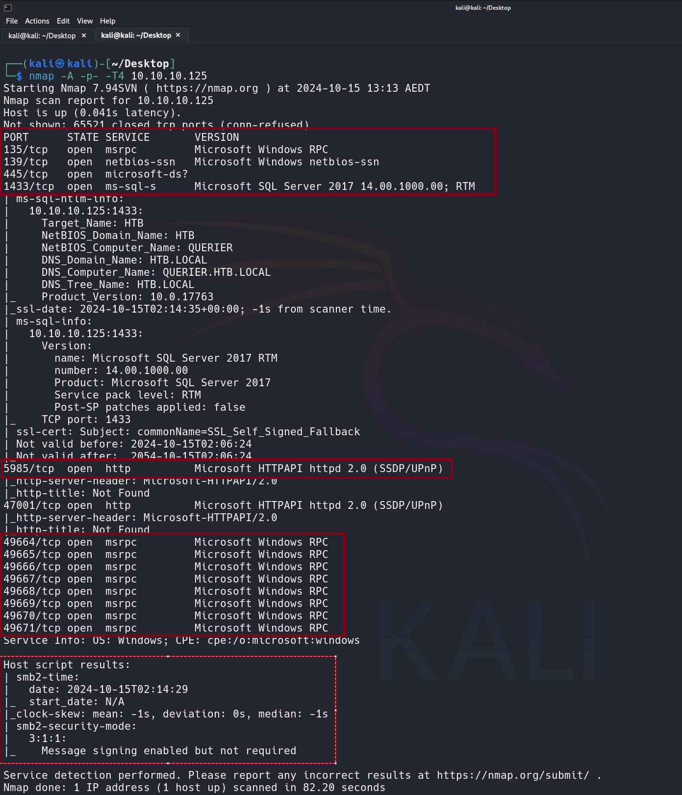

The nmap scan reveals several Windows services, including SMB (ports 135/139/445), MSSQL (port 1433), and WinRM (port 5985). The message "signing enabled but not required" suggests vulnerability to SMB relay attacks.

**ii. SMB Enumeration**

Since I discovered the SMB port, I performed enumeration by connecting to the target machine's SMB service using the smbclient tool `smbclient -N -L [//10.10.10.125](https://10.10.10.125/)`

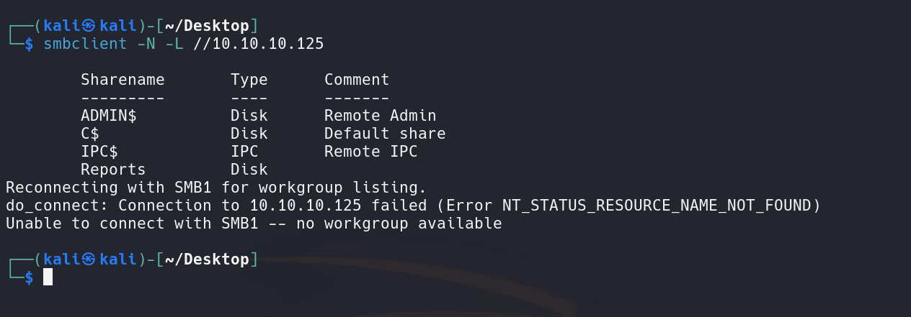

**iii. Discovery of Report.xlms**

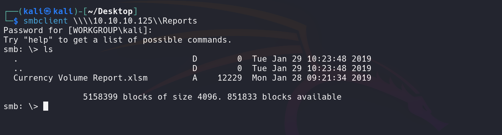

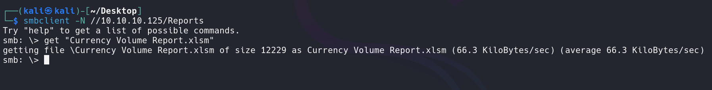

In the "Reports" folder, I discovered a file named "Currency Volume Report.xlsm". This is a Microsoft Excel 2007 file. Excel files are typically stored as archive files, which means we can extract their contents.
So I decided to use binwalk to analyze the file structure and potentially extract any hidden files or embedded content within the `.xlsm` file. By running binwalk, I can inspect the different components that make up the Excel file, such as XML data, embedded objects, or even VBA macros that might be present. This approach allows me to see if any sensitive or malicious data is hidden within the file, which could be critical in a vulnerability analysis or malware investigation.

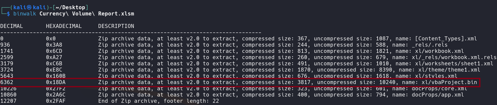

After extracting the file, I discovered a file named `vbaProject.bin` within the xl directory.

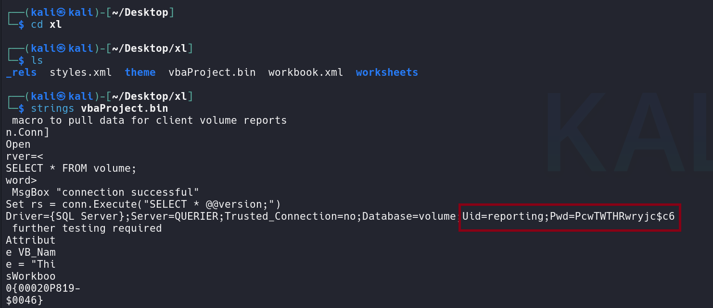

```jsx
Uid=reporting
Pwd=PcwTWTHRwryjc$c6
```

**iv. MSSQL**

Utilizing the provided password and Uid from the file `vbaProject.bin`  I can connect with `mssqlclient.py`

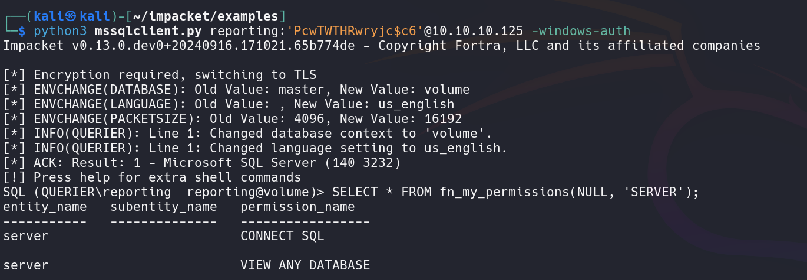

I examine the database and check my current permissions. The previous nmap result "`message signing enabled but not required`" suggests that the target machine may be vulnerable to SMB relay attacks.

### b. Exploitation

1. **mssql-svc enumeration**

I’ll start responder to capture authentication requests sent over protocols like SMB (Server Message Block), which is commonly used in Windows environments.

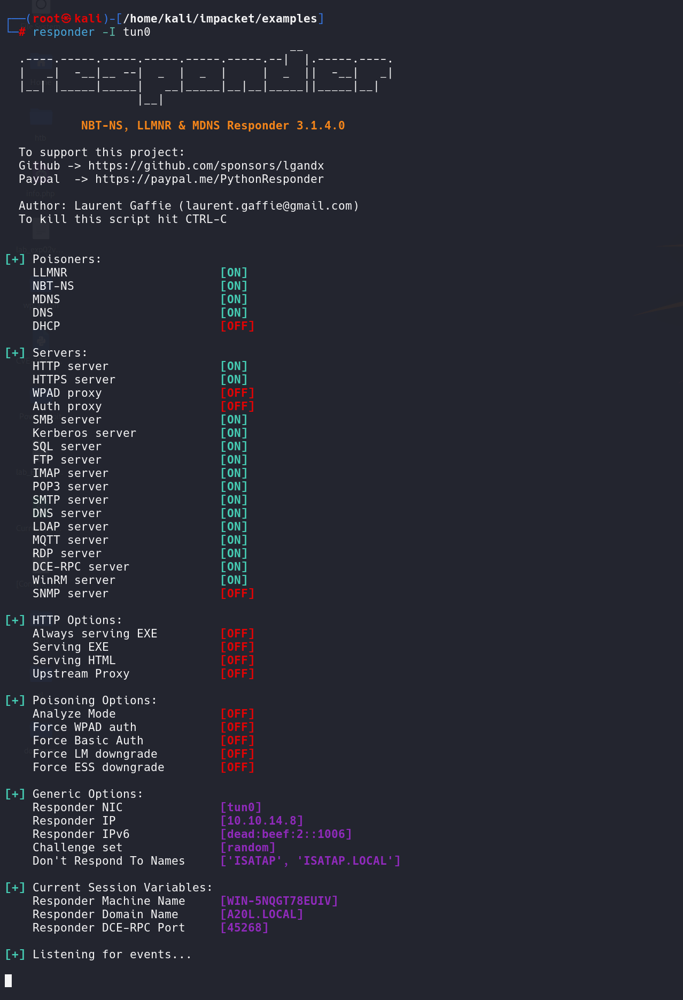

Now I can use the `xp_dirtree` command to compel the SQL Server to connect to a network share (SMB) under my control in this case is `SHARE`.

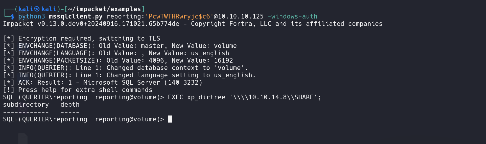

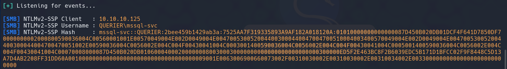

```jsx
[SMB] NTLMv2-SSP Client   : 10.10.10.125
[SMB] NTLMv2-SSP Username : QUERIER\mssql-svc
[SMB] NTLMv2-SSP Hash     : mssql-svc::QUERIER:2bee459b1429ab3a:7525AA7F319335893A9AF182A018120A:01010000000000000087D450B020DB01DCF4F641D7850DF70000000002000800590036004C00560001001E00570049004E002D0049004E0047005300520044003000440047004700510004003400570049004E002D0049004E004700530052004400300044004700470051002E00590036004C0056002E004C004F00430041004C0003001400590036004C0056002E004C004F00430041004C0005001400590036004C0056002E004C004F00430041004C00070008000087D450B020DB0106000400020000000800300030000000000000000000000000300000ED5F2E463BC8F2B6039EDC5B171D1BFCC02F9F8448C5D13A7D4AB2208FF31DD60A0010000000000000000000000000000000000009001E0063006900660073002F00310030002E00310030002E00310034002E003300000000000000000000000000
```

**ii. Crack netntlmv2 using hashcat**

We can bruteforce the password using hashcat

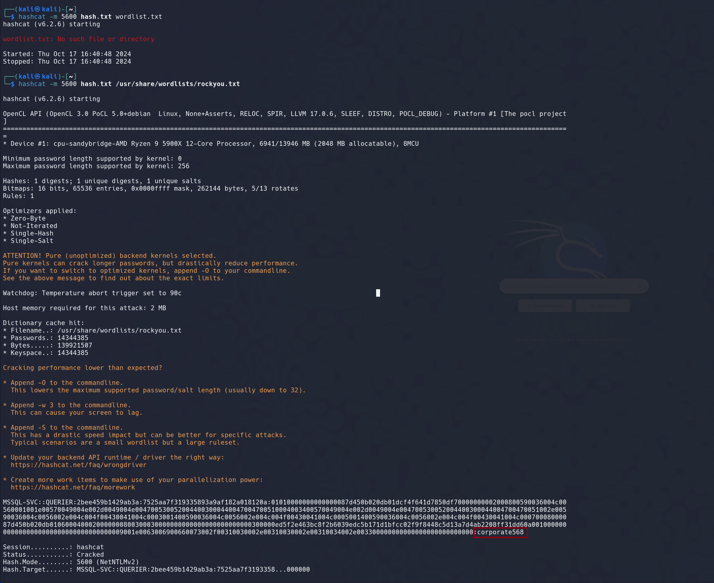

**iii. Connect to mssql-srv and read user flag**

I can connect to mssql-srv with the password `corporate568`

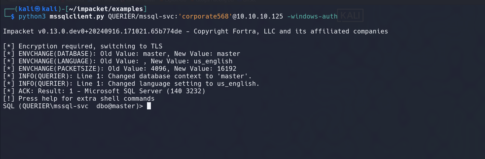

Now I can establish a reverse shell on our local machine. To accomplish this, I'll upload nc.exe from our machine using Python's built-in HTTP server with the command "python3 -m http.server 80" to host the file.

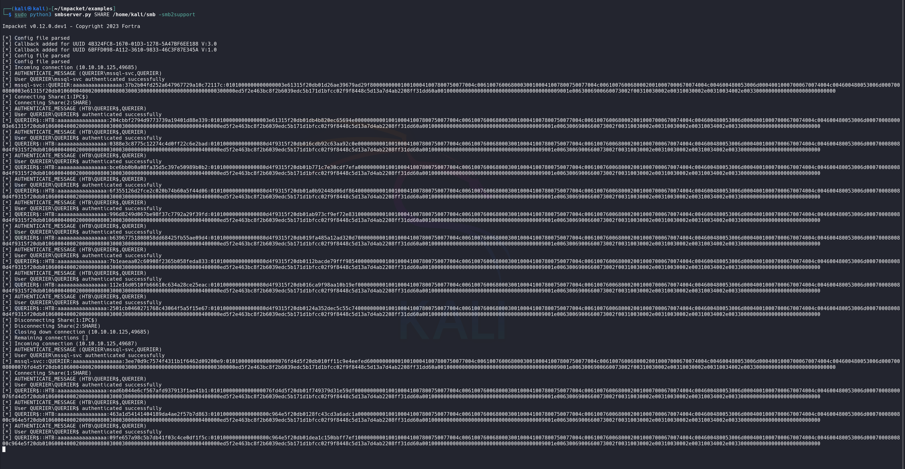

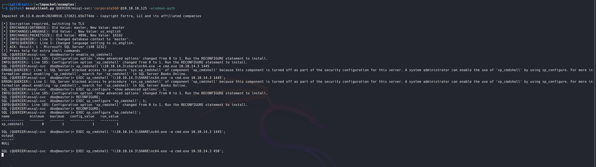

Got the shell

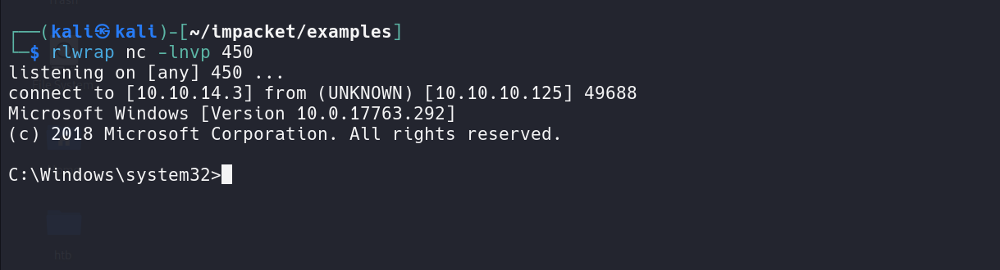

From here I can just cd to /Users/mssql-svc/Desktop and read user flag.

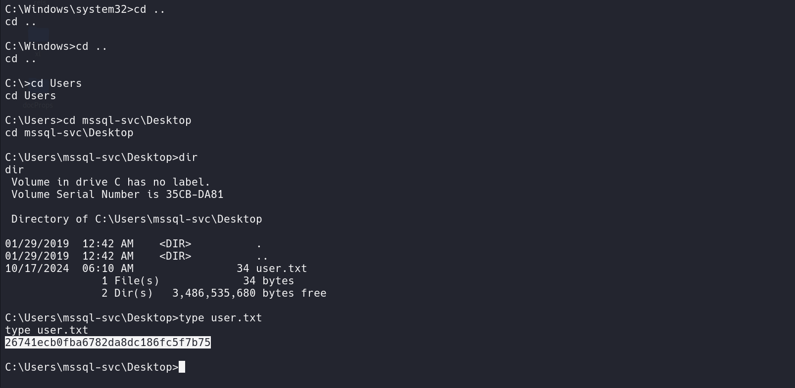

### c. Privilege Escalation To Admin

1. **Enumeration**

I use `PowerUp.ps1`, a PowerShell script from the **PowerSploit** toolkit designed for **privilege escalation** checks on Windows systems. This tool automates the process of identifying misconfigurations and vulnerabilities that might allow a low-privileged user to elevate their permissions.

I copy PowerUp.ps1 to temp and **`.** **.**\PowerUp.ps1` to execute Powerup and run it with `Invoke-AllChecks`

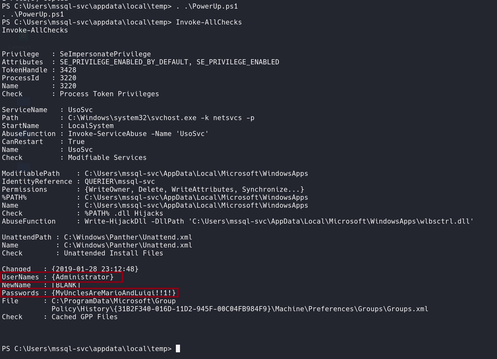

We get admin UseNames  `Administrator` and Passwords `MyUnclesAreMarioAndLuigi!!1!`

**ii. Administrator Shell**
I connect to the remote machine `10.10.10.125` with the `Administrator` account and password `MyUnclesAreMarioAndLuigi!!!1!`. It launches a semi-interactive shell over **WMI (Windows Management Instrumentation)**, which allows the user to execute commands remotely on the machine.

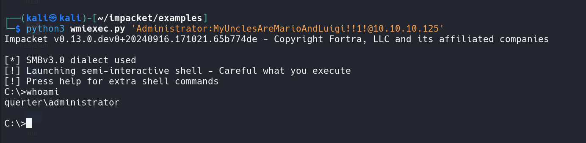

Now I can just go straight to administrator desktop and read flag.

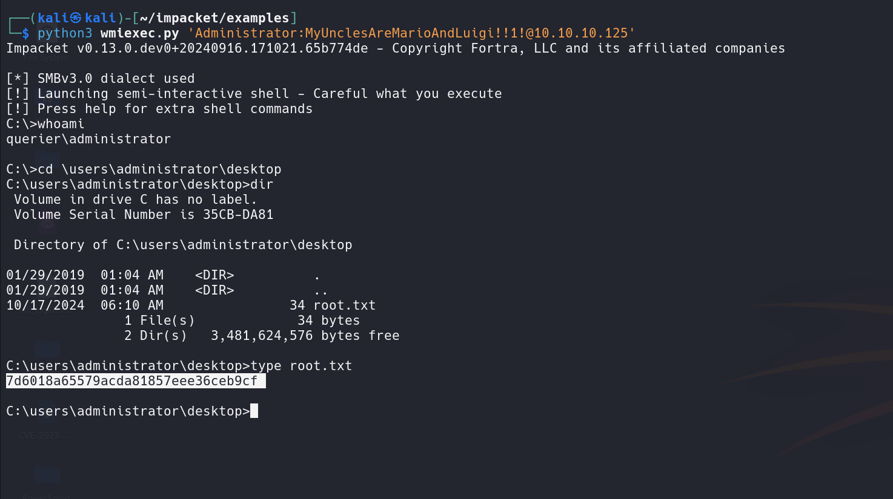

## 5. Impact Rating

The impact rating assesses how severe the vulnerabilities are based on their likelihood of being exploited and the potential damage they could cause. For this specific case:

- **Privilege Escalation**: The ability to escalate privileges from a lower-level account (mssql-svc) to Administrator represents a **high-risk vulnerability** (P1 Critical) because it can lead to complete system control.
- **SMB Relay**: The absence of SMB signing could enable an attacker to perform relay attacks, allowing credential capture or further network compromises, posing a **high to critical risk** depending on the context.

### 6. Mitigation & Recommendations

- **Enable SMB Signing**: Enforcing SMB signing would prevent relay attacks and mitigate one of the main attack vectors used.
- **Restrict xp_cmdshell**: Disable `xp_cmdshell` in MSSQL and limit the accounts that can enable it.
- **Audit Privilege Escalation Paths**: Use tools like `PowerUp.ps1` to regularly audit and fix misconfigurations that could lead to privilege escalation.
- **Use Stronger Password Policies**: Implement stronger, complex passwords and enforce rotation, especially for privileged accounts like Administrator.

## 7. Conclusion

The Querier HTB machine demonstrated several critical vulnerabilities that allowed privilege escalation and remote code execution. By exploiting insecure SMB configurations and weak password policies, attackers can escalate privileges to Administrator and compromise the entire system. Addressing these vulnerabilities through better security configurations, including SMB signing, limiting administrative privileges, and stronger password policies, would greatly enhance the security posture of this system.